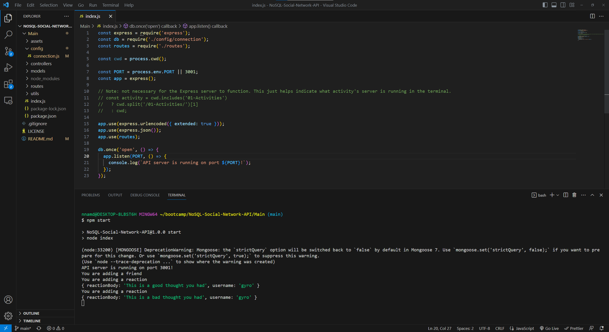
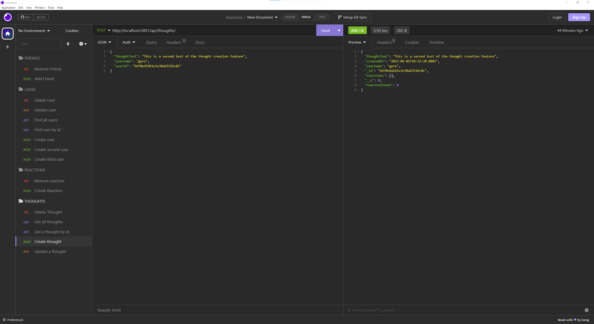

# NoSQL-Social-Network-API

## Description

This project is an API for a social media website build using NoSQL.

## Table of Contents

- [Screenshots](#screenshots)

- [Installation](#installation)

- [Usage](#usage)

- [License](#license)

- [Contributing](#contributing)

- [Walkthrough Video](#walkthrough-video)

- [Questions](#questions)

## Screenshots

## Installation

- To install the necessary dependencies, run 'npm i' in the terminal.

## Usage

Run 'npm start' to start the application's server.

## License

The license being used for this application is the MIT license.

## Contributing

N/A

## Walkthrough Video

https://youtu.be/Kd30NvcakUw

## Questions

If you have any questions feel free to reach out to me at my email nnamdionyeije@gmail.com or through my GitHub at [https://github.com/nnamdionyeije](https://github.com/nnamdionyeije/).
